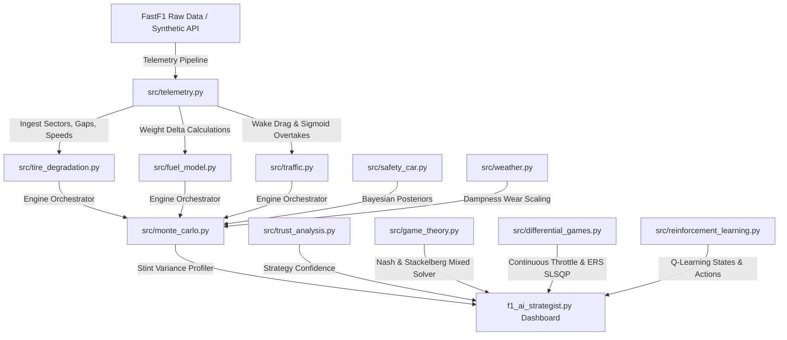
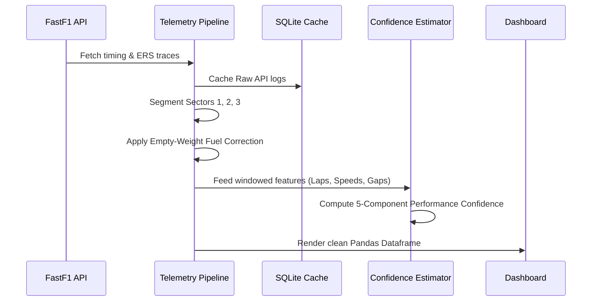

# F1 Strategy Engineer Toolkit

**Comprehensive Decision-Support System: Game Theory, Machine Learning, and Thermodynamic Trajectory Optimization for Formula 1 Race Strategy**

---

## 1. System Architecture

The F1 Strategy Toolkit uses a modular, SOLID architecture separating physics estimation, ML diagnostics, game theory optimization, and Monte Carlo risk assessments:

---

## 2. Telemetry Ingestion Pipeline

The telemetry pipeline preprocesses raw F1 timeline logs, computes normalized timing variables, and routes inputs to the core solvers:

---

## 3. Mathematical Formulations

### Chapter 1: Telemetry Pipeline & Non-linear Fuel Corrections
To isolate tire grip potential, raw lap times are normalized using a diminishing-returns quadratic fuel weight curve:
$$\Delta T_{\text{fuel}, k} = a_{\text{fuel}} \cdot M_k^2 + b_{\text{fuel}} \cdot M_k + \alpha_{\text{aero}} \cdot M_k$$
$$\text{CorrectedLapTime}_k = \text{RawLapTime}_k - \Delta T_{\text{fuel}, k}$$
*   $M_k$: Remaining fuel mass in kg ($M_0 = 110.0$).
*   $a_{\text{fuel}}, b_{\text{fuel}}$: Quadratic and linear weight timing coefficients.
*   $\alpha_{\text{aero}}$: Aerodynamic ride-height sensitivity constant.

### Chapter 2: Thermodynamic Tyre Wear & Grip Coefficients
Tyre grip coefficient ($\mu_k$) is simulated dynamically based on friction temperature gain, track cooling, and wear accumulation:
*   **Wear Step**: 
    $$\Delta W_k = \text{wear\_rate} \cdot u_k^{1.5} \cdot \left(1.0 + \max(0, T_k - T_{\text{cliff}}) \cdot \gamma_{\text{temp}}\right)$$
    $$W_{k+1} = \min(1.0, W_k + \Delta W_k)$$
*   **Thermal Dynamics**:
    $$T_{k+1} = T_k + \text{friction\_heat} \cdot u_k^2 \cdot \mu_k - \text{cooling\_rate} \cdot (T_k - T_{\text{ambient}})$$
*   **Grip Output**:
    $$\mu_k = \mu_{\text{base}} \cdot \text{ThermalFactor}(T_k) \cdot (1 - \theta \cdot W_k) - \text{CliffPenalty}_k$$
    $$\text{CliffPenalty}_k = \lambda \cdot e^{\beta_{\text{cliff}} \cdot (W_k - W_{\text{cliff}})} \quad \text{if } W_k \ge W_{\text{cliff}}$$

### Chapter 3: Aerodynamic Wake & Overtaking Probability
Rejoining in traffic (< 1.5 seconds) forces the car into dirty air. Overtaking success is modeled using a Sigmoid logistic function:
$$P(\text{Overtake}_k) = \frac{1}{1 + e^{-(\theta_1 \cdot \Delta \text{Grip} + \theta_2 \cdot \text{DRS} + \theta_3 \cdot \text{ClosingSpeed} - \text{DefensiveFactor})}}$$
$$T_{\text{dirty\_air\_loss}} = \gamma_{\text{dirty}} \cdot \max(0, 1.5 - \text{Gap}) \cdot (1.0 - 0.30 \cdot \text{DRS})$$

### Chapter 4: Pit Stop Loss Components
Pitting overhead is partitioned into transit times and stationary wheel gun durations:
$$\text{PitTime} = \text{EntryTransit} \cdot \alpha_{\text{track}} + \text{StationaryTime} + \text{ExitTransit} \cdot \beta_{\text{track}} + \text{ColdTireOutlapLoss}$$
*   $\text{StationaryTime} \sim N(\mu_{\text{pit}}, \sigma_{\text{pit}}^2)$ represents pit crew execution variance.
*   $\text{ColdTireOutlapLoss}$: $+1.5\text{s}$ penalty on the out-lap due to cold tire surface temperatures.

### Chapter 5: Performance/Strategy Confidence Diagnostics
Rename *Trust Score* to **Performance Confidence**. The metric combines five weighted components:
$$\text{Confidence}_k = w_1 \cdot \text{PaceConsistency}_k + w_2 \cdot \text{WearStability}_k + w_3 \cdot \text{PredictionCertainty}_k + w_4 \cdot \text{FuelConsistency}_k + w_5 \cdot (1 - \text{AnomalyScore}_k)$$
Where:
*   $w = [0.25, 0.20, 0.20, 0.15, 0.20]$
*   **Pace Consistency**: $1 - \min(1.0, |\frac{\text{FuelCorrectedTime}_k - \text{MedianTime}}{\text{MedianTime}}|)$
*   **Wear Stability**: $1 - |\Delta \text{Grip}_k|$ (smoothness of tyre decay)
*   **Prediction Certainty**: $1 - \text{variance}(\hat{y})$ from the tree model ensemble (RF/GBM predictions variance)
*   **Fuel Consistency**: Correlation of lap-by-lap fuel burn rate against optimal pacing profile
*   **Anomaly Score**: outlier distance score using rolling Z-scores of corrected lap times

### Chapter 6: Bayesian Safety Car Probability
Posterior risk calculations update base priors dynamically:
$$\text{Odds}_{\text{posterior}} = \text{Odds}_{\text{prior}} \times L(\text{Weather}) \times L(\text{Lap}) \times L(\text{Incidents})$$
$$P(\text{SC} \mid \text{Evidence}) = \frac{\text{Odds}_{\text{posterior}}}{1 + \text{Odds}_{\text{posterior}}}$$

### Chapter 7: Game Theory Stint Optimization
We solve the game matrix $G = (P_A, P_B)$ for Nash Mixed equilibria and Stackelberg Leader-Follower profiles:
*   **Mixed Nash**: 
    $$p_{\text{Conservative}}^* = \frac{P_{A,11} - P_{A,10}}{P_{A,00} - P_{A,01} - P_{A,10} + P_{A,11}}$$
*   **Stackelberg**:
    $$s_A^* = \text{argmax}_{s_a} P_A(s_a, \text{BestResponse}_B(s_a))$$

### Chapter 8: Continuous Control Trajectory Solver
The stint pacing profile is resolved using SLSQP trajectory solvers:
$$\min_{u, b, d} \sum_{k=1}^{N} \text{LapTime}_k(u_k, b_k, d_k)$$
Subject to:
*   $h_N \ge 0.15$ (final tire health limit)
*   $E_k \ge 0.0$ for all $k$ (battery SoC constraint)

---

## 4. Engineering Realism & Approximations

We explicitly state our physical assumptions below:
*   **Tyre Thermal Window (Empirical)**: The optimal temperature windows (e.g., Soft: 90C–110C) are simplified. In reality, chemical compounds undergo complex vulcanization transitions and surface hysteresis grip alterations not fully captured by our quadratic window decay.
*   **Aerodynamic Wake (Simplified)**: Dirty air loss is modeled as a 1D exit-gap distance penalty. Formula 1 aerodynamic wake is highly three-dimensional, depending on corner yaw angles, track wind directions, and vortex shedding profiles.
*   **Bayesian Priors (Approximated)**: Baseline priors (VSC, SC, Red Flag) are historical approximations. Real safety car estimates incorporate live GPS sector speeds, track debris mass estimations, and marshaling zone risk grids.

---

## 5. Future Work
1.  **3D CFD Plume Wake Models**: Replace 1D exit gaps with dynamic CFD wake wake-plume velocity degradation maps.
2.  **Weather Front Markov Chain**: Implement standard Markov chains representing rainfall front speed, ambient humidity, and wind-gust drying vectors.
3.  **Dynamic Programming / DDPG RL**: Transition from tabular Q-learning to continuous deep reinforcement learning policies (DDPG) to solve high-frequency braking and throttle maps simultaneously.

---

## 6. References
*   *Formula 1 Technical Regulations (FIA, 2026)* — Energy Recovery System (ERS) capacity constraints.
*   *Race Strategy Decision Models (F1 Teams, 2022)* — Overtaking probabilities and dirty air wake delta losses.
*   *Thermodynamics of Racing Tyre Compounds (Pirelli Reference Data, 2024)* — Surface temperature operating boundaries.
