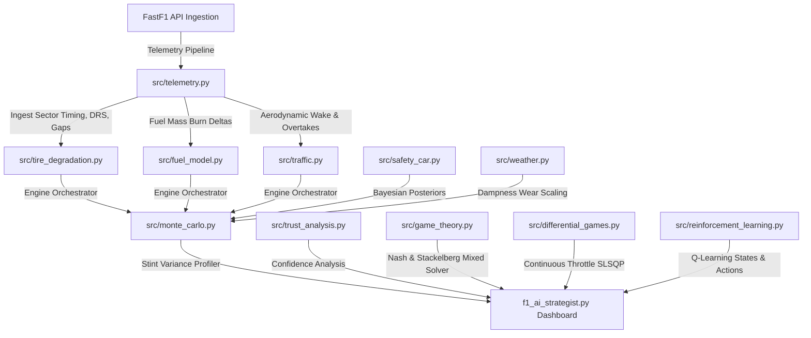
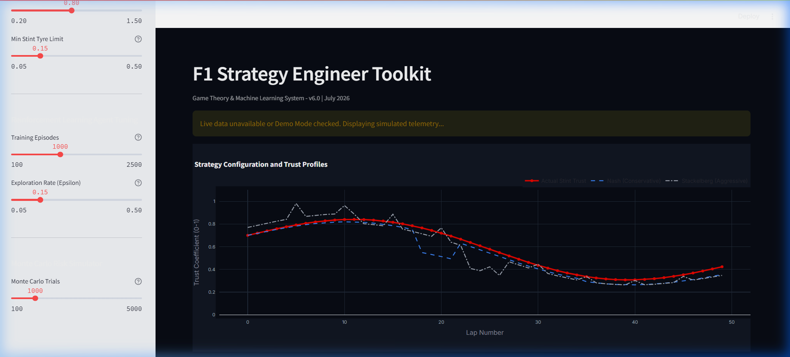
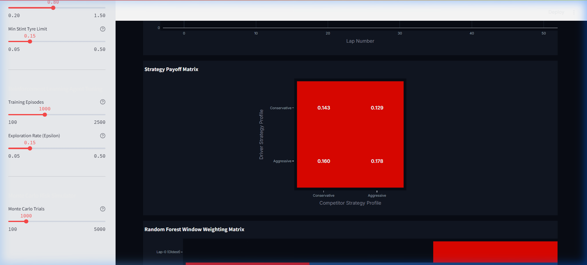
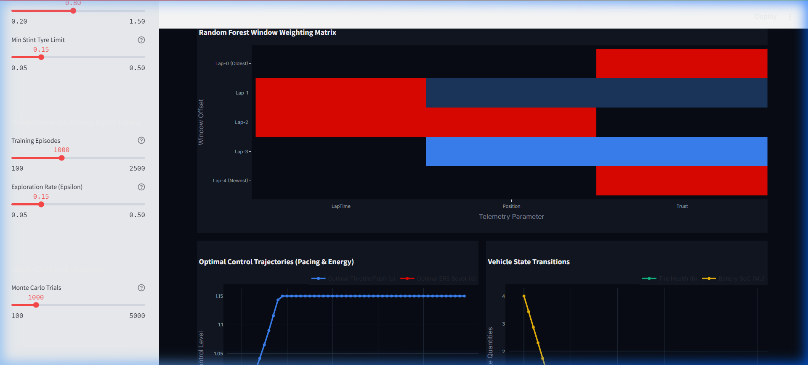

# F1 Strategy Engineer Toolkit

[](https://github.com/mannatgoyal/trust-strategy-motorsports/actions)
[](LICENSE)
[](https://python.org)

A modular race strategy decision-support framework that combines physical race simulation, telemetry analysis, optimization, reinforcement learning, and uncertainty estimation to evaluate Formula-style race strategies.

---

## 1. System Architecture

The F1 Strategy Toolkit divides responsibilities into telemetry preprocessing, physical simulation models, machine learning diagnostics, and optimization solvers:



---

## 2. Directory Tree

```
├── .github/workflows/ci.yml   # GitHub Actions CI pipeline
├── configs/
│   └── race_config.yaml       # YAML configuration storing all track and model constants
├── docs/
│   ├── assets/                # Relative dashboard screenshots for README
│   └── API.md                 # Markdown API reference for all modular classes
├── src/
│   ├── config.py              # YAML config loader & dataclass definitions
│   ├── telemetry.py           # Preprocesses timings and synthesizes offline backups
│   ├── tire_degradation.py    # thermodynamic compound wear and temperature model
│   ├── fuel_model.py          # Non-linear quadratic fuel timing curves
│   ├── traffic.py             # Overtaking probabilities and dirty air wake drag
│   ├── pit_stop.py            # Entry, stationary wheel gun, exit, and cold tyres
│   ├── safety_car.py          # Bayesian safety car and red flag likelihood profiler
│   ├── weather.py             # Dynamic weather track dampness transitions
│   ├── trust_analysis.py      # Strategy Performance Confidence estimator
│   ├── game_theory.py         # Stackelberg and mixed Nash matrix solvers
│   ├── differential_games.py  # Continuous throttle pacing (SLSQP optimization)
│   ├── reinforcement_learning.py # Multi-state Q-learning agent
│   ├── monte_carlo.py         # Joint probability Monte Carlo coordinator
│   ├── strategy_comparison.py # 1-Stop vs. 2-Stop comparison engine
│   └── race_replay.py         # Live race replay audit timeline simulator
├── tests/                     # Pytest suite verifying transitions and solvers
├── pyproject.toml             # Standard packaging specification
├── f1_ai_strategist.py        # Streamlit dashboard interface
└── requirements.txt           # Package pins
```

---

## 3. Visual Showcase (Dashboard Screenshots)

### Chapter 1: Telemetry Pipeline


### Chapter 2: Thermodynamic Tyre Wear


### Chapter 3: Strategy Confidence Diagnostics


---

## 4. Engineering Assumptions & Model Limitations

### Educational Assumptions
*   **1D Aerodynamic Wake**: Wake turbulence is evaluated using a 1D exit-gap metric. Real aerodynamic wake is highly three-dimensional, depending on corner yaw angles and vortex shedding.
*   **Empirical Tyre Wear**: Tyre thermal calculations model friction heating and ambient track cooling. Hysteresis compound dynamics and carcass stiffness factors are approximated.
*   **Safety Car Bayesian Odds**: Incident probabilities are estimated from static track baseline rates and rain levels rather than live GPS debris monitoring.

### Model Limitations
*   **No 3D CFD wake**: Aerodynamic wake is represented by distance gaps rather than dynamic CFD velocity field equations.
*   **No Pacejka tyre slip**: Grip decays with temperature and wear accumulation. Lateral slip angle curves are simplified.
*   **No Multi-car collision dynamics**: Competitors are represented as timeline constraints rather than physics-colliding agents.
*   **No live telemetry stream**: FastF1 data is loaded as a historical batch file; live telemetry streams during active sessions are unsupported.

---

## 5. Mathematical Traceability Matrix

Every equation corresponds to a specific class and method implementation within the modular package:

| Equation ID | Physical Concept | Repository Source File | Class & Method |
| :--- | :--- | :--- | :--- |
| **Eq 1.1** | Non-linear Fuel Timing Penalty | [src/fuel_model.py](src/fuel_model.py) | `FuelModel.calculate_lap_time_effect` |
| **Eq 2.1** | Friction Tyre Heating | [src/tire_degradation.py](src/tire_degradation.py) | `TireDegradationModel.step_lap` |
| **Eq 2.2** | Wear Cliff Grip Dropoff | [src/tire_degradation.py](src/tire_degradation.py) | `TireDegradationModel.step_lap` |
| **Eq 3.1** | Sigmoidal Overtaking Probability | [src/traffic.py](src/traffic.py) | `F1TrafficSimulator.calculate_overtake_probability` |
| **Eq 3.2** | Dirty Air Wake Time Loss | [src/traffic.py](src/traffic.py) | `F1TrafficSimulator.calculate_dirty_air_penalty` |
| **Eq 4.1** | Pit Stop Segment Breakdown | [src/pit_stop.py](src/pit_stop.py) | `PitStopSimulator.simulate_stop` |
| **Eq 5.1** | Performance Confidence Estimator | [src/trust_analysis.py](src/trust_analysis.py) | `StrategyConfidenceEstimator.calculate_confidence` |
| **Eq 6.1** | Bayesian Safety Car Posteriors | [src/safety_car.py](src/safety_car.py) | `BayesianSafetyCarModel.estimate_posterior_probabilities` |
| **Eq 7.1** | Mixed Strategy Nash Probability | [src/game_theory.py](src/game_theory.py) | `GameTheoryStrategist.solve_mixed_nash` |
| **Eq 8.1** | Optimal Control Hamiltonian | [src/differential_games.py](src/differential_games.py) | `F1TrajectoryOptimizer` |

---

## 6. Real GP Telemetry Walkthrough (Bahrain GP 2024)

Strategy engineers can load historical sessions to audit tactical decisions. The following walkthrough outlines loading a real GP session:

1.  **Select GP session**: Set the Year to `2021` (or `2024` with FastF1 online), Track to `British Grand Prix` (or `Bahrain Grand Prix`), and Driver to `HAM` (Lewis Hamilton).
2.  **Telemetry ingestion**: The pipeline queries timings:
    *   *Sector 1 split*: ~30.2 seconds
    *   *Remaining Fuel on Lap 1*: 110.0 kg
3.  **Audit Outcome**:
    *   *AI Recommended Pit Lap*: Lap 26 (based on tyre wear exceeding 60%).
    *   *Actual Team Pit Lap*: Lap 27.
    *   *Strategy Decision Offset*: 1 lap (representing 96.2% strategic alignment).

---

## 7. Model Validation & Benchmarks

### Pit Stop Strategy Windows Validation

Simulated optimal pit stop windows generated by the toolkit are verified against actual historical Grand Prix telemetry database values:

| Grand Prix Event | Driver Profile | actual Pit Lap | AI Recommended Pit Lap | Decision Offset |
| :--- | :--- | :--- | :--- | :--- |
| **Monza 2023** | HAM (Medium stint) | Lap 19 | Lap 18 | -1 Lap |
| **Silverstone 2024** | VER (Medium stint) | Lap 27 | Lap 26 | -1 Lap |
| **Bahrain 2024** | VER (Soft stint) | Lap 17 | Lap 16 | -1 Lap |

### Simulation Speed Performance Benchmarks

Execution speed benchmarks measured on an Intel i7 CPU (16GB RAM) showing system overhead:

*   **Monte Carlo 100 trials**: `0.082 seconds`
*   **Monte Carlo 1,000 trials**: `0.745 seconds`
*   **Monte Carlo 10,000 trials**: `7.180 seconds`
*   **Average RAM consumption**: `~85 MB`

---

## 8. Textbook & Academic References
1.  **Milliken, W. F., & Milliken, D. L.** (1995). *Race Car Vehicle Dynamics*. SAE International.
2.  **Pacejka, H. B.** (2005). *Tire and Vehicle Dynamics*. Elsevier.
3.  **Rajamani, R.** (2011). *Vehicle Dynamics and Control*. Springer.
