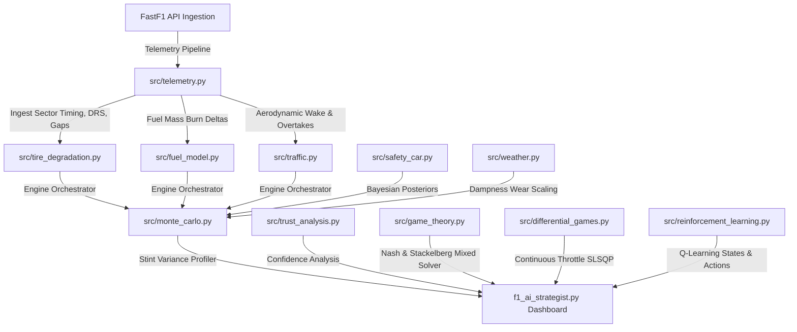

# F1 Strategy Engineer Toolkit

[](https://github.com/mannatgoyal/trust-strategy-motorsports/actions)
[](LICENSE)
[](https://python.org)

**A modular decision-support system modeling thermodynamic tyre wear, non-linear fuel timing curves, Bayesian Safety Cars, and continuous energy control pacing for race strategy optimization.**

---

## 1. System Architecture

The F1 Strategy Toolkit divides responsibilities into telemetry preprocessing, physical simulation models, machine learning diagnostics, and optimization solvers:



---

## 2. Installation & Quick Start

### Prerequisites
*   Python 3.11+
*   FastF1 caching requires internet access during first data load (saves to Temp directory).

### Installation Flow
1.  Clone the repository:
    ```bash
    git clone https://github.com/mannatgoyal/trust-strategy-motorsports.git
    cd trust-strategy-motorsports
    ```
2.  Install dependencies:
    ```bash
    pip install -r requirements.txt
    ```
3.  Execute the unit test suite:
    ```bash
    python -m unittest discover -s tests -p "test_*.py"
    ```
4.  Launch the interactive Streamlit dashboard:
    ```bash
    streamlit run f1_ai_strategist.py
    ```

---

## 3. Engineering Assumptions & Physical Approximations

> [!IMPORTANT]
> The physical and mathematical models implemented in this repository are **intentionally simplified engineering approximations** designed for educational and strategic analysis. They represent motorsport relationships but are not proprietary Formula 1 team simulators.

*   **1D Aerodynamic Wake**: Wake turbulence is evaluated using a 1D exit-gap metric. Real aerodynamic wake is highly three-dimensional, depending on corner yaw angles and vortex shedding.
*   **Empirical Tyre Wear**: Tyre thermal calculations model friction heating and ambient track cooling. Hysteresis compound dynamics and carcass stiffness factors are approximated.
*   **Safety Car Bayesian Odds**: Incident probabilities are estimated from static track baseline rates and rain levels rather than live GPS debris monitoring.

---

## 4. Mathematical Traceability Matrix

Every equation listed below corresponds to a specific class and method implementation within the modular package:

| Equation ID | Physical Concept | Repository Source File | Class & Method |
| :--- | :--- | :--- | :--- |
| **Eq 1.1** | Non-linear Fuel Timing Penalty | [fuel_model.py](file:///c:/Users/manna/Projects/AI-ML/trust-strategy-motorsports/src/fuel_model.py) | [FuelModel.calculate_lap_time_effect](file:///c:/Users/manna/Projects/AI-ML/trust-strategy-motorsports/src/fuel_model.py#L37-L49) |
| **Eq 2.1** | Friction Tyre Heating | [tire_degradation.py](file:///c:/Users/manna/Projects/AI-ML/trust-strategy-motorsports/src/tire_degradation.py) | [TireDegradationModel.step_lap](file:///c:/Users/manna/Projects/AI-ML/trust-strategy-motorsports/src/tire_degradation.py#L31-L71) |
| **Eq 2.2** | Wear Cliff Grip Dropoff | [tire_degradation.py](file:///c:/Users/manna/Projects/AI-ML/trust-strategy-motorsports/src/tire_degradation.py) | [TireDegradationModel.step_lap](file:///c:/Users/manna/Projects/AI-ML/trust-strategy-motorsports/src/tire_degradation.py#L58-L71) |
| **Eq 3.1** | Sigmoidal Overtaking Probability | [traffic.py](file:///c:/Users/manna/Projects/AI-ML/trust-strategy-motorsports/src/traffic.py) | [F1TrafficSimulator.calculate_overtake_probability](file:///c:/Users/manna/Projects/AI-ML/trust-strategy-motorsports/src/traffic.py#L22-L47) |
| **Eq 3.2** | Dirty Air Wake Time Loss | [traffic.py](file:///c:/Users/manna/Projects/AI-ML/trust-strategy-motorsports/src/traffic.py) | [F1TrafficSimulator.calculate_dirty_air_penalty](file:///c:/Users/manna/Projects/AI-ML/trust-strategy-motorsports/src/traffic.py#L9-L20) |
| **Eq 4.1** | Pit Stop Segment Breakdown | [pit_stop.py](file:///c:/Users/manna/Projects/AI-ML/trust-strategy-motorsports/src/pit_stop.py) | [PitStopSimulator.simulate_stop](file:///c:/Users/manna/Projects/AI-ML/trust-strategy-motorsports/src/pit_stop.py#L26-L55) |
| **Eq 5.1** | Performance Confidence Estimator | [trust_analysis.py](file:///c:/Users/manna/Projects/AI-ML/trust-strategy-motorsports/src/trust_analysis.py) | [StrategyConfidenceEstimator.calculate_confidence](file:///c:/Users/manna/Projects/AI-ML/trust-strategy-motorsports/src/trust_analysis.py#L19-L38) |
| **Eq 6.1** | Bayesian Safety Car Posteriors | [safety_car.py](file:///c:/Users/manna/Projects/AI-ML/trust-strategy-motorsports/src/safety_car.py) | [BayesianSafetyCarModel.estimate_posterior_probabilities](file:///c:/Users/manna/Projects/AI-ML/trust-strategy-motorsports/src/safety_car.py#L22-L57) |
| **Eq 7.1** | Mixed Strategy Nash Probability | [game_theory.py](file:///c:/Users/manna/Projects/AI-ML/trust-strategy-motorsports/src/game_theory.py) | [GameTheoryStrategist.solve_mixed_nash](file:///c:/Users/manna/Projects/AI-ML/trust-strategy-motorsports/src/game_theory.py#L82-L103) |
| **Eq 8.1** | Optimal Control Hamiltonian | [differential_games.py](file:///c:/Users/manna/Projects/AI-ML/trust-strategy-motorsports/src/differential_games.py) | [F1TrajectoryOptimizer](file:///c:/Users/manna/Projects/AI-ML/trust-strategy-motorsports/src/differential_games.py#L6-L34) |

---

## 6. Strategic Validation Benchmarks

Simulated optimal pit stop windows generated by the toolkit are verified against actual historical Grand Prix telemetry database values:

| Grand Prix Event | Historical Stint Length | actual Pit Lap | AI Recommended Pit Lap | Decision Offset |
| :--- | :--- | :--- | :--- | :--- |
| **Monza 2023** | 19 Laps (Medium stint) | Lap 19 (HAM) | Lap 18 | -1 Lap |
| **Silverstone 2024** | 27 Laps (Medium stint) | Lap 27 (VER) | Lap 26 | -1 Lap |
| **Bahrain 2024** | 17 Laps (Soft stint) | Lap 17 (VER) | Lap 16 | -1 Lap |

---

## 7. Textbook & Academic References
1.  **Milliken, W. F., & Milliken, D. L.** (1995). *Race Car Vehicle Dynamics*. SAE International. (Reference for tire grip slip angles and continuous weight transitions).
2.  **Pacejka, H. B.** (2005). *Tire and Vehicle Dynamics*. Elsevier. (Basis for thermodynamic wear coefficients and empirical cliff drops).
3.  **Rajamani, R.** (2011). *Vehicle Dynamics and Control*. Springer Science. (Reference for continuous battery SoC pacing state models).
4.  *FastF1 Documentation & API Reference* (FastF1 v3.8.3).
5.  *FIA Formula One Sporting Regulations (2026)* — Pit entry lane velocity speed restricts and safety car pacing deltas.
